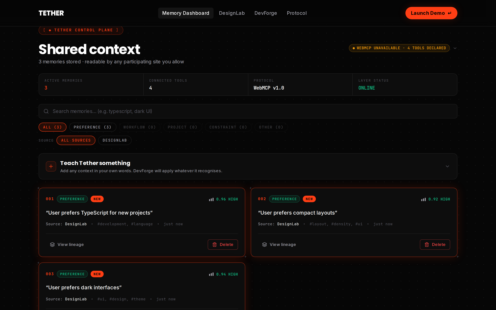
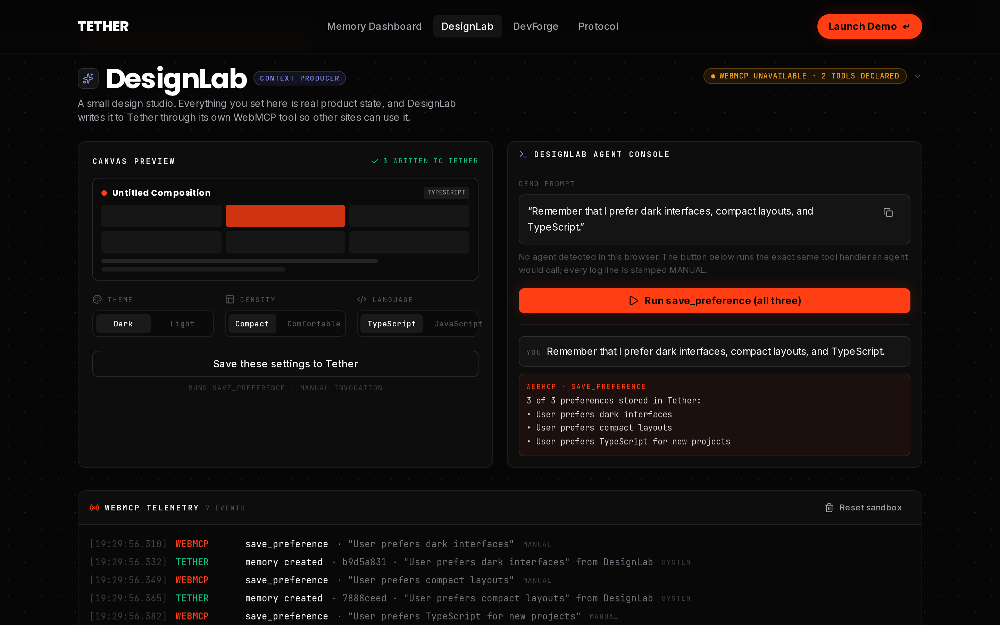
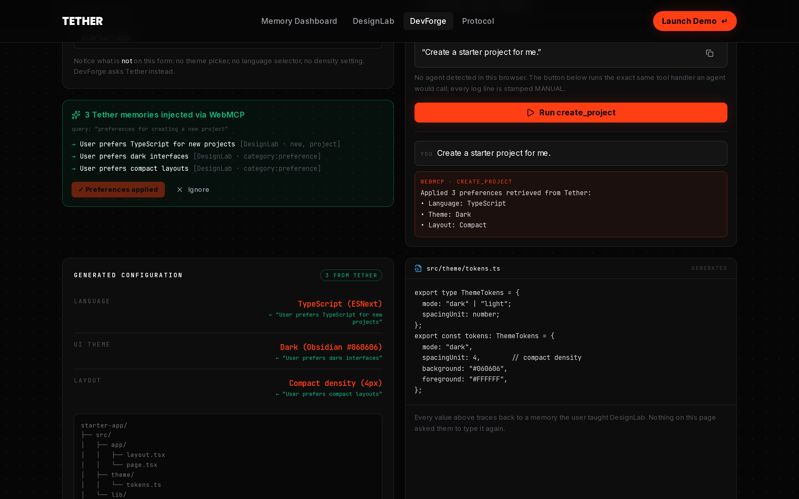
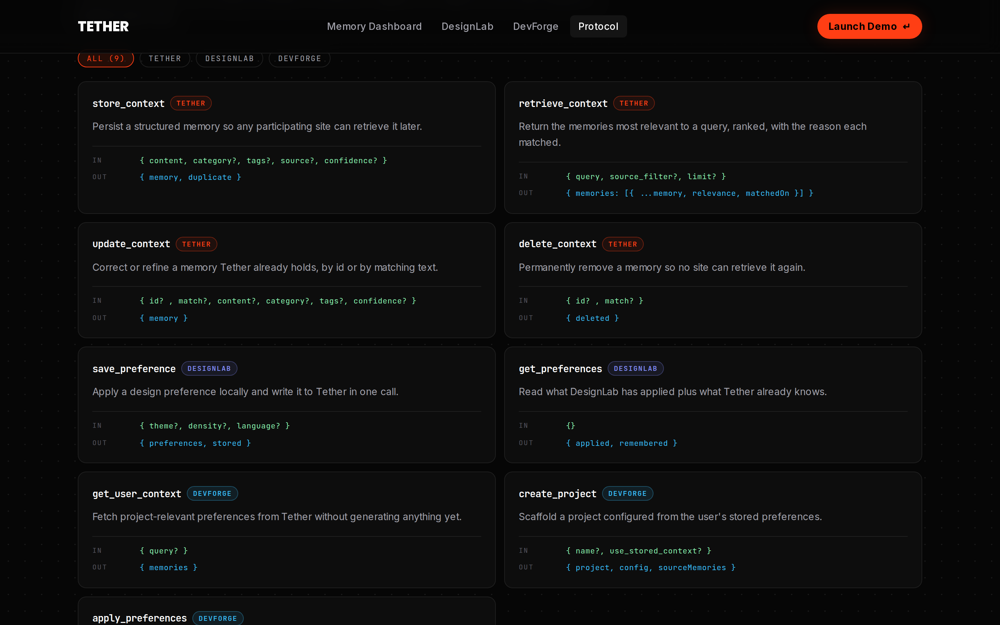

# Tether

**Teach once. Carry forward.**

A shared memory layer for the agent-native web. Participating websites expose WebMCP tools that
save, retrieve, update, and delete user context — while the human decides what persists.

**[▶ Live demo](https://tether-swart.vercel.app)** · [Memory dashboard](https://tether-swart.vercel.app/dashboard) · [DesignLab](https://tether-swart.vercel.app/designlab) · [DevForge](https://tether-swart.vercel.app/devforge) · [Protocol](https://tether-swart.vercel.app/protocol)

Built for the [WebMCP Challenge](https://webmcp.devpost.com).

### See it in 30 seconds

1. Open [DesignLab](https://tether-swart.vercel.app/designlab) and press **Run save_preference (all three)**
2. Open [the dashboard](https://tether-swart.vercel.app/dashboard) — three memories are already there
3. Open [DevForge](https://tether-swart.vercel.app/devforge), press **Run create_project** — it builds a
   TypeScript / Dark / Compact project you never configured
4. Delete the TypeScript memory in the dashboard, scaffold again — the language falls back to JavaScript

Step 4 is the point: the memory is doing the work, not a hardcoded demo path.

---

## What it is

Agents lose useful context at the tab boundary. You tell one site you prefer dark interfaces,
compact layouts, and TypeScript — then open the next site and type it all again. The user becomes
the integration layer.

Tether is the shared persistence layer that removes that step. It stores **structured** memories —
content, category, tags, source, confidence — and exposes them through WebMCP tools that any
participating site can call from the user's own browser session.

This repository ships three real surfaces sharing one memory layer:

| Surface | Route | Role |
| --- | --- | --- |
| **Tether Control Plane** | `/dashboard` | Inspect, search, edit, and permanently delete every memory |
| **DesignLab** | `/designlab` | Context **producer** — a design studio that teaches Tether your preferences |
| **DevForge** | `/devforge` | Context **consumer** — a scaffolder that configures a project from them |

## Why WebMCP

WebMCP lets a website hand an agent real, page-provided capabilities instead of making it guess at
a DOM that was never meant for it. Tether uses that to make memory a normal part of a web workflow:
the agent calls `save_preference` while you are actually designing, and `create_project` while you
are actually scaffolding.

> **Being precise about this:** WebMCP does **not** carry memory between unrelated sites on its own.
> It is the tool interface on each page. Tether is the shared backplane those tools read from and
> write to. The cross-site continuity comes from the shared layer, not from the protocol.

## The problem

- **Context amnesia** — every new tab or session flushes previous instructions.
- **Walled silos** — assistant memory is locked into closed vendor clouds.
- **Redundant prompting** — the first minutes of every session go to re-configuring basics.
- **Zero governance** — context is collected silently, with no audit trail and no purge path.

## How the cross-site demo works

1. Open **DesignLab** and tell the agent: *"Remember that I prefer dark interfaces, compact layouts,
   and TypeScript."*
2. DesignLab's `save_preference` tool applies those settings **and** writes three structured
   memories to Tether.
3. Open **Tether** — the memories are already there, each showing source, tool, tags, confidence,
   and time.
4. Open **DevForge**, a site that has never met you, and ask for a starter project.
5. DevForge's `create_project` tool calls Tether first, then generates a project configured as
   TypeScript / Dark / Compact. **No preferences were entered on DevForge.**
6. Delete a memory in Tether, scaffold again, and watch that setting fall back to a default.

Step 6 is the proof that the memory — not a hardcoded demo path — is doing the work.

## Architecture

```text
   DesignLab  ──WebMCP──┐
                        ├──►  Tether API  ──►  Postgres (or in-memory)
   DevForge   ──WebMCP──┘          ▲
                                   │
                        Human governance plane
                    (inspect · edit · delete · audit)
```

- **Tool registration** happens client-side against the page's model context.
- **Every tool input** is validated with Zod before it reaches the store.
- **The activity log is server-side**, so a tool call in the DesignLab tab appears live in the
  Tether tab. That cross-tab visibility is what makes the flow legible on camera.
- **The store is pluggable**: Supabase Postgres when configured, otherwise a durable in-process
  driver so a fresh clone runs with zero environment variables.

### WebMCP adapter

Different WebMCP builds expose the model context differently, so
[`src/lib/webmcp.ts`](src/lib/webmcp.ts) probes `navigator.modelContext`, `window.modelContext`,
and `document.modelContext`, and supports both the imperative `registerTool()` and declarative
`provideContext()` shapes.

**If no model context is found, the UI says so.** Tools stay declared, on-page controls execute the
identical handlers, and every resulting log line is stamped `MANUAL`. Tether never fakes a tool call.

## WebMCP tools

Nine tools across three surfaces. Each has a constrained input schema, predictable structured
output, and a real product purpose.

### Tether — `src/components/surfaces/TetherControlPlane.tsx`

| Tool | Purpose |
| --- | --- |
| `store_context` | Persist a structured memory other sites can retrieve |
| `retrieve_context` | Ranked retrieval, with the reason each memory matched |
| `update_context` | Correct or refine a memory, by id or matching text |
| `delete_context` | Permanently remove a memory from every site |

### DesignLab — `src/components/surfaces/DesignLab.tsx`

| Tool | Purpose |
| --- | --- |
| `save_preference` | Apply a design preference locally **and** write it to Tether |
| `get_preferences` | Read what DesignLab applied plus what Tether already knows |

### DevForge — `src/components/surfaces/DevForge.tsx`

| Tool | Purpose |
| --- | --- |
| `get_user_context` | Fetch project-relevant preferences without generating yet |
| `create_project` | Scaffold a project configured from stored preferences |
| `apply_preferences` | Apply or drop Tether context, so provenance stays visible |

## API

| Method | Path | Notes |
| --- | --- | --- |
| `POST` | `/api/memory` | Create a memory. Idempotent on content, so an agent retry never double-writes |
| `GET` | `/api/memory` | List the session's memories (`?source=`, `?category=`) |
| `GET` | `/api/memory/search?q=` | Ranked retrieval with per-memory `relevance` and `matchedOn` |
| `GET` | `/api/memory/:id` | Fetch one memory |
| `PATCH` | `/api/memory/:id` | Update content, category, tags, or confidence |
| `DELETE` | `/api/memory/:id` | Permanent removal — the human control path |
| `GET` / `POST` / `DELETE` | `/api/activity` | Read, append to, or reset the WebMCP telemetry log |
| `GET` | `/api/health` | Store driver and liveness |

### Data model

```ts
type Memory = {
  id: string;
  userId: string;                 // opaque per-session id, not an account
  content: string;
  category: "preference" | "workflow" | "project" | "constraint" | "other";
  tags: string[];
  source: string;                 // the site that learned it
  confidence: number;             // 0–1
  scope: "personal";
  createdAt: string;
  updatedAt: string;
};
```

### Retrieval

Lexical scoring in [`src/lib/match.ts`](src/lib/match.ts): tag hits weigh most, then content-word
overlap, then a category-intent nudge, with confidence only breaking ties. Deliberately not
embeddings — the corpus is a handful of short structured statements, and this way the UI can show
the user *why* each memory matched instead of asserting relevance.

## Local setup

```bash
git clone <this-repo>
cd tether
npm install
npm run dev          # http://localhost:3000
```

That is the whole setup. With no environment variables Tether uses its in-process store, which is
ideal for local demos and recording.

```bash
npm run build        # production build
npm run start        # serve the production build
npm run typecheck    # tsc --noEmit
```

### Environment variables

Both are optional. Set them together to persist memories in Supabase Postgres — recommended for a
deployed demo, since serverless functions do not share in-process state.

| Variable | Scope | Purpose |
| --- | --- | --- |
| `NEXT_PUBLIC_SUPABASE_URL` | public | Supabase project URL |
| `SUPABASE_SERVICE_ROLE_KEY` | **server only** | Read exclusively inside `server-only` modules |

```bash
cp .env.example .env.local
```

Then run [`supabase/migrations/0001_init.sql`](supabase/migrations/0001_init.sql) in the Supabase
SQL editor. The service-role key is never bundled into client code — `src/lib/store.ts` imports
`server-only`, so any accidental client import fails the build rather than leaking a credential.

### Deploying

Import the repository into Vercel, add the two environment variables, and deploy. No other
configuration is required.

The live deployment runs on Vercel with Supabase Postgres. Confirm the driver actually switched
with `curl <your-url>/api/health` — it must report `{"status":"online","driver":"supabase"}`. If it
says `in-memory`, an environment variable did not take, and memories will not survive between
requests because serverless functions do not share process state.

Use the **secret** / `service_role` key, never the publishable or `anon` key. RLS is enabled with no
permissive policies, so a publishable key authenticates fine but reads zero rows and cannot write —
which looks like a broken app rather than a misconfigured one.

## Demo flow

To reproduce the recorded demo from a clean state:

1. Open `/designlab` and press **Reset sandbox** in the telemetry panel.
2. Ask your agent (or press **Run save_preference**) to remember the three preferences.
3. Open `/dashboard` — three memories, tagged and sourced, appear without a manual refresh.
4. Open `/devforge` and ask for a starter project. Watch the retrieval banner and the generated
   config, with each value tracing back to the memory that produced it.
5. Return to `/dashboard`, delete one memory, and scaffold again in DevForge.

## Screenshots

### 1. Tether memory feed

Three memories stored by DesignLab, each showing source, tags, confidence, and time.



### 2. DesignLab storing context

`save_preference` applies the settings locally and writes them to Tether in one call.



### 3. DevForge retrieving context — the "aha" moment

DevForge has no theme, language, or density control on its form. It retrieves them from Tether
instead, and every generated value traces back to the memory that produced it.



### 4. WebMCP tool registration

The nine tools registered across the three surfaces, with the real `registerTool` adapter code.



## Tech stack

Next.js 15 (App Router) · TypeScript · Tailwind CSS · Zod · Supabase Postgres · Lucide ·
WebMCP model context API.

## Security and privacy

This is a hackathon MVP, presented as such — not a production data platform.

- No secrets in the browser; the service-role key lives in `server-only` modules.
- Memories are scoped to an opaque random id in an `httpOnly` first-party cookie. No accounts, no PII.
- Every tool input and API body is validated by Zod: length caps, category enums, tag limits, and a
  bounded confidence score.
- Memory content is rendered as text by React and never injected as HTML.
- `DELETE` removes the row. No archive table, no soft-delete flag.
- Row-level security is enabled on both tables with no permissive policies, so an anon key reads
  nothing.

There is no authentication and no multi-user isolation beyond the session cookie. Do not store
sensitive personal data in it.

## License

[MIT](LICENSE)
